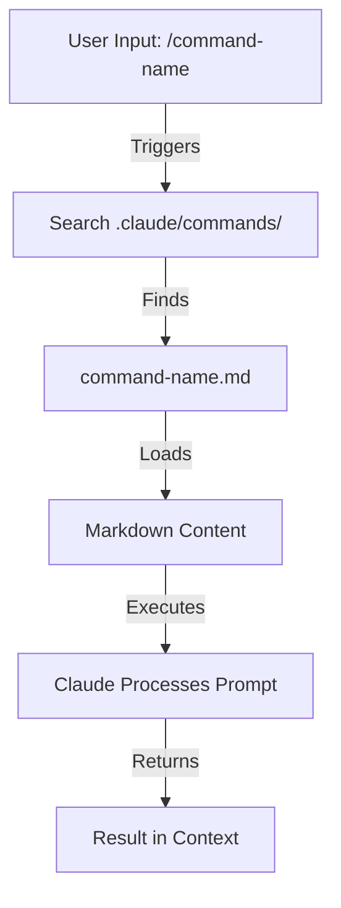
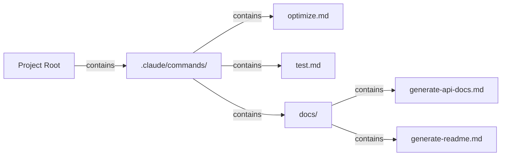
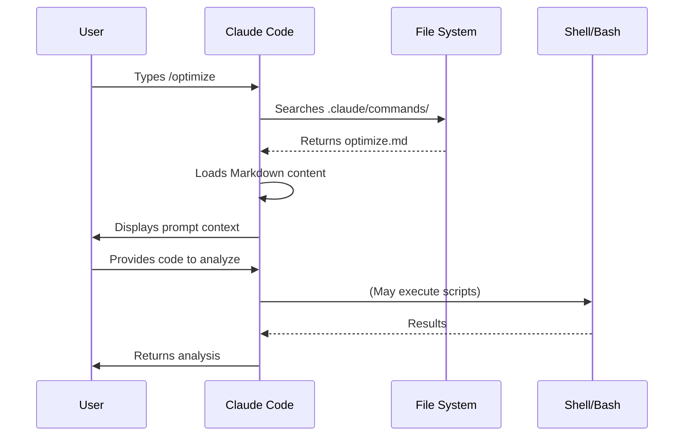

# Slash Commands

## Overview

Slash commands are user-invoked shortcuts stored as Markdown files that Claude Code can execute. They enable teams to standardize frequently-used prompts and workflows.

## Architecture



## File Structure



### Recommended Structure

```
project/
├── .claude/
│   └── commands/
│       ├── optimize.md
│       ├── pr.md
│       └── docs/
│           └── generate-api-docs.md
```

## Command Organization Table

| Location | Scope | Availability | Use Case | Git Tracked |
|----------|-------|--------------|----------|-------------|
| `.claude/commands/` | Project-specific | Team members | Team workflows, shared standards | ✅ Yes |
| `~/.claude/commands/` | Personal | Individual user | Personal shortcuts across projects | ❌ No |
| Subdirectories | Namespaced | Based on parent | Organize by category | ✅ Yes |

## Features & Capabilities

| Feature | Example | Supported |
|---------|---------|-----------|
| Shell script execution | `bash scripts/deploy.sh` | ✅ Yes |
| File references | `@path/to/file.js` | ✅ Yes |
| Bash integration | `$(git log --oneline)` | ✅ Yes |
| Arguments | `/pr --verbose` | ✅ Yes |
| MCP commands | `/mcp__github__list_prs` | ✅ Yes |

## Available Commands in This Folder

### 1. `/optimize` - Code Optimization
Analyzes code for performance issues, memory leaks, and optimization opportunities.

**Usage:**
```
/optimize
[Paste your code]
```

**Reviews for:**
- Performance bottlenecks (O(n²) operations)
- Memory leaks
- Algorithm improvements
- Caching opportunities
- Concurrency issues

### 2. `/pr` - Pull Request Preparation
Guides you through PR preparation checklist including linting, testing, and commit message formatting.

**Usage:**
```
/pr
```

**Checklist includes:**
- Running linting
- Running tests
- Reviewing git diff
- Staging changes
- Creating conventional commit messages
- Generating PR summary

**Screenshot**


### 3. `/generate-api-docs` - API Documentation Generator
Generates comprehensive API documentation from source code.

**Usage:**
```
/generate-api-docs
```

**Features:**
- Scans all files in `/src/api/`
- Extracts function signatures and JSDoc comments
- Organizes by endpoint/module
- Creates markdown with examples
- Includes request/response schemas
- Adds error documentation

## Command Lifecycle Diagram



## Installation

### For Project-wide Use (Team)

Copy these files to your project's `.claude/commands/` directory:

```bash
# Create commands directory if it doesn't exist
mkdir -p .claude/commands

# Copy command files
cp 01-slash-commands/*.md .claude/commands/

# Copy subdirectory commands
cp -r 01-slash-commands/docs .claude/commands/
```

### For Personal Use

Copy to your personal Claude commands directory:

```bash
# Create personal commands directory
mkdir -p ~/.claude/commands

# Copy command files
cp 01-slash-commands/*.md ~/.claude/commands/
```

## Creating Your Own Commands

### Basic Command Template

Create a file `.claude/commands/my-command.md`:

```markdown
---
name: My Command Name
description: What this command does
tags: category, task-type
---

# Command Title

Instructions for Claude:

1. First step
2. Second step
3. Third step

Output format:
- How to format the response
- What to include
```

### Command with Frontmatter

```markdown
---
name: Code Optimization
description: Analyze code for performance issues and suggest optimizations
tags: performance, analysis
---

# Code Optimization

Review the provided code for the following issues in order of priority:

1. **Performance bottlenecks** - identify O(n²) operations, inefficient loops
2. **Memory leaks** - find unreleased resources, circular references
3. **Algorithm improvements** - suggest better algorithms or data structures

Format your response with:
- Issue severity (Critical/High/Medium/Low)
- Location in code
- Explanation
- Recommended fix with code example
```

## Best Practices

| ✅ Do | ❌ Don't |
|------|---------|
| Use clear, action-oriented names | Create commands for one-time tasks |
| Document trigger words in description | Build complex logic in commands |
| Keep commands focused on single task | Create redundant commands |
| Version control project commands | Hardcode sensitive information |
| Organize in subdirectories | Create long lists of commands |
| Use simple, readable prompts | Use abbreviated or cryptic wording |

## Examples

### Example 1: Simple Task Automation

**File:** `.claude/commands/test.md`

```markdown
---
name: Run Tests
description: Execute test suite with coverage report
---

# Test Runner

1. Run the test suite: `npm test`
2. Generate coverage report
3. Summarize results
4. Highlight any failures
```

### Example 2: Multi-step Workflow

**File:** `.claude/commands/deploy.md`

```markdown
---
name: Deploy to Production
description: Complete deployment workflow with checks
---

# Production Deployment

Execute these steps in order:

1. **Pre-deployment checks**
   - Run `npm run lint`
   - Run `npm test`
   - Check git status is clean

2. **Build**
   - Run `npm run build`
   - Verify build artifacts

3. **Deploy**
   - Run `npm run deploy`
   - Monitor deployment logs

4. **Post-deployment**
   - Run smoke tests
   - Verify deployment
   - Notify team
```

### Example 3: Code Review Command

**File:** `.claude/commands/review.md`

```markdown
---
name: Code Review
description: Comprehensive code review checklist
---

# Code Review

Review the code for:

## Security
- [ ] No hardcoded credentials
- [ ] Input validation present
- [ ] SQL injection prevention
- [ ] XSS prevention

## Performance
- [ ] No N+1 queries
- [ ] Appropriate indexing
- [ ] Efficient algorithms

## Quality
- [ ] Clear naming
- [ ] Proper error handling
- [ ] Adequate comments
- [ ] No code duplication
```

## Advanced Usage

### Using Arguments

Commands can accept arguments:

```bash
/deploy production
/review --verbose
/test --coverage
```

Handle arguments in your command file:

```markdown
# Deployment Command

Check the provided argument for environment:
- If "production", use strict checks
- If "staging", allow warnings
- If "development", skip certain validations
```

### Integrating with MCP

Commands can use MCP tools:

```markdown
# GitHub PR Command

1. Use MCP to list open PRs: `/mcp__github__list_prs`
2. Analyze each PR for:
   - Review status
   - CI/CD status
   - Merge conflicts
3. Provide summary
```

### Hierarchical Commands

Organize related commands in subdirectories:

```
.claude/commands/
├── deploy/
│   ├── production.md
│   ├── staging.md
│   └── rollback.md
├── test/
│   ├── unit.md
│   ├── integration.md
│   └── e2e.md
└── docs/
    ├── api.md
    └── readme.md
```

Access with: `/deploy/production`, `/test/unit`, `/docs/api`

## Troubleshooting

### Command Not Found

**Problem:** Claude doesn't recognize `/my-command`

**Solutions:**
- Check file is in `.claude/commands/` directory
- Verify filename matches command name
- Restart Claude Code session
- Check file has `.md` extension

### Command Not Executing as Expected

**Problem:** Command loads but doesn't work correctly

**Solutions:**
- Review command prompt clarity
- Add more specific instructions
- Include examples in command file
- Test with simple inputs first

### Personal vs Project Commands

**When to use personal commands:**
- Personal preferences/workflows
- Not relevant to team
- Experimental commands
- Cross-project shortcuts

**When to use project commands:**
- Team standards
- Project-specific workflows
- Shared conventions
- Onboarding helpers

## Related Concepts

- **[Memory](../02-memory/)** - For persistent context
- **[Skills](../03-skills/)** - For auto-invoked capabilities
- **[Subagents](../04-subagents/)** - For complex, delegated tasks
- **[Plugins](../07-plugins/)** - For bundled command collections

## Resources

- [Discovering Claude Code Slash Commands](https://medium.com/@luongnv89/discovering-claude-code-slash-commands-cdc17f0dfb29) - Comprehensive blog post exploring slash commands
- [Claude Code Commands Documentation](https://docs.claude.com/en/docs/claude-code/custom-commands)
- [Markdown Guide](https://www.markdownguide.org/)
- [Command Examples Repository](https://github.com/anthropics/claude-code-examples)

---

*Part of the [Claude How To](../) guide series*
