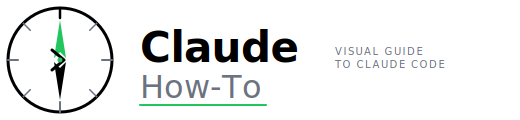

<picture>
  <source media="(prefers-color-scheme: dark)" srcset="logos/claude-howto-logo-dark.svg">
  
</picture>

# Claude How To - Brand Assets

Complete collection of logos, icons, and favicons for the Claude How To project. All assets use the new V2.0 design: a 12-ray organic starburst inspired by Claude's official logo, with emerald green color and educational symbolism.

## Directory Structure

```
resources/
├── logos/
│   ├── claude-howto-logo.svg       # Main logo - Light mode (800×200px)
│   └── claude-howto-logo-dark.svg  # Main logo - Dark mode (800×200px)
├── icons/
│   ├── claude-howto-icon.svg       # App icon - Light mode (256×256px)
│   └── claude-howto-icon-dark.svg  # App icon - Dark mode (256×256px)
└── favicons/
    ├── favicon-16.svg              # Favicon - 16×16px
    ├── favicon-32.svg              # Favicon - 32×32px (primary)
    ├── favicon-64.svg              # Favicon - 64×64px
    ├── favicon-128.svg             # Favicon - 128×128px
    └── favicon-256.svg             # Favicon - 256×256px
```

## Assets Overview

### Design Concept (V2.0)

**12-Ray Organic Starburst** inspired by Claude's official logo:
- **12 Rays** = Knowledge radiating outward
- **Emerald Gradient** = Primary green color (#10b981 → #059669)
- **Mint Core** = Learning value provided
- **Three Inner Lines** = Guides, examples, documentation
- **Claude-Aligned** = Matches official Claude logo pattern

### Logos

**Files**:
- `logos/claude-howto-logo.svg` (Light mode)
- `logos/claude-howto-logo-dark.svg` (Dark mode)

**Specifications**:
- **Size**: 800×200 px
- **Purpose**: Main header/branding logo with wordmark
- **Usage**:
  - Website headers
  - Marketing materials
  - README badges
  - Print materials
- **Format**: SVG (fully scalable)
- **Modes**: Light (white background) & Dark (forest background)

### Icons

**Files**:
- `icons/claude-howto-icon.svg` (Light mode)
- `icons/claude-howto-icon-dark.svg` (Dark mode)

**Specifications**:
- **Size**: 256×256 px
- **Purpose**: Application icon, avatars, thumbnails
- **Usage**:
  - App icons
  - Profile avatars
  - Social media thumbnails
  - Documentation headers
- **Format**: SVG (fully scalable)
- **Modes**: Light (white background) & Dark (with glow effect)

**Design Elements**:
- 12-ray organic starburst (Claude-inspired)
- Emerald green gradient rays
- Mint gradient core (represents guide hub)
- Three inner lines (symbolize guides/examples/docs)
- Glow effects in dark mode

### Favicons

Optimized versions at multiple sizes for web use:

| File | Size | DPI | Usage |
|------|------|-----|-------|
| `favicon-16.svg` | 16×16 px | 1x | Browser tabs (older browsers) |
| `favicon-32.svg` | 32×32 px | 1x | Standard browser favicon |
| `favicon-64.svg` | 64×64 px | 1x-2x | High-DPI displays |
| `favicon-128.svg` | 128×128 px | 2x | Apple touch icon, bookmarks |
| `favicon-256.svg` | 256×256 px | 4x | Modern browsers, PWA icons |

**Optimization Notes**:
- Smaller sizes (16-32px) use simplified geometry
- Larger sizes (64-256px) include additional details
- All maintain visual consistency with main icon
- SVG format ensures crisp display at any size

## HTML Integration

### Basic Favicon Setup

```html
<!-- Browser favicon -->
<link rel="icon" type="image/svg+xml" href="/resources/favicons/favicon-32.svg">
<link rel="icon" type="image/svg+xml" href="/resources/favicons/favicon-16.svg" sizes="16x16">

<!-- Apple touch icon (mobile home screen) -->
<link rel="apple-touch-icon" href="/resources/favicons/favicon-128.svg">

<!-- PWA & modern browsers -->
<link rel="icon" type="image/svg+xml" href="/resources/favicons/favicon-256.svg" sizes="256x256">
```

### Complete Setup

```html
<head>
  <!-- Primary favicon -->
  <link rel="icon" type="image/svg+xml" href="/resources/favicons/favicon-32.svg" sizes="32x32">
  <link rel="icon" type="image/svg+xml" href="/resources/favicons/favicon-16.svg" sizes="16x16">

  <!-- Apple touch icon -->
  <link rel="apple-touch-icon" href="/resources/favicons/favicon-128.svg">

  <!-- PWA icons -->
  <link rel="icon" type="image/svg+xml" href="/resources/favicons/favicon-256.svg" sizes="256x256">

  <!-- Android -->
  <link rel="shortcut icon" href="/resources/favicons/favicon-256.svg">

  <!-- PWA manifest reference (if using manifest.json) -->
  <meta name="theme-color" content="#0d1f0d">
</head>
```

## Color Palette

### Primary Colors
- **Deep Forest**: `#0d1f0d` (Background)
- **Emerald**: `#10b981` (Primary accent)
- **Dark Emerald**: `#059669` (Secondary)
- **Forest**: `#047857` (Tertiary)

### Accent Colors
- **Mint**: `#6ee7b7` (Highlight)
- **Light Mint**: `#34d399` (Secondary highlight)

### Usage Guidelines
- Use emerald for primary interactions and accents
- Use mint for highlights and emphasis
- Deep forest for backgrounds
- Maintain sufficient contrast for accessibility

## Design Guidelines

### Logo Usage
✅ **Do**:
- Use on dark backgrounds
- Scale proportionally (maintain 4:1 aspect ratio)
- Include clear space around logo
- Use in color as shown

❌ **Don't**:
- Change colors or gradients
- Stretch or distort proportions
- Use on light backgrounds without modification
- Apply effects that obscure the design

### Icon Usage
✅ **Do**:
- Use at standard sizes: 16, 32, 64, 128, 256px
- Maintain the ascending progression concept
- Scale proportionally

❌ **Don't**:
- Rotate or flip the icon
- Change the color scheme
- Use small sizes where details are lost

### Favicon Usage
- Use appropriate size for context
- 16-32px: Browser tabs, bookmarks
- 64px: Favicon site icons
- 128px+: Apple/Android home screens

## SVG Optimization

All SVG files include:
- Gradient definitions for smooth color transitions
- Filter effects for depth and glow
- Optimized stroke widths
- Responsive design patterns

For web optimization:
```bash
# Compress SVG while maintaining quality
svgo --config='{
  "js2svg": {
    "indent": 2
  },
  "plugins": [
    "convertStyleToAttrs",
    "removeRasterImages"
  ]
}' input.svg -o output.svg
```

## PNG Conversion

To convert SVG to PNG for older browser support:

```bash
# Using ImageMagick
convert -density 300 -background none favicon-256.svg favicon-256.png

# Using Inkscape
inkscape -D -z --file=favicon-256.svg --export-png=favicon-256.png
```

## Accessibility

- All icons include clear geometric shapes
- High contrast color ratios (WCAG AA compliant)
- Scalable vector format works at any size
- No text in icons (text added separately if needed)

## Attribution

These assets are part of the Claude How To project and use Anthropic's Claude color palette and design language.

**License**: MIT (see project LICENSE file)

## Version History

- **v2.0** (January 2026): Claude-inspired 12-ray starburst design with dark/light mode variants
- **v1.0** (January 2026): Original hexagon-based progression icon design

---

**Last Updated**: January 2026
**Current Version**: 2.0 (Claude-Inspired Starburst)
**All Assets**: Production-ready SVG, fully scalable, WCAG AAA accessible
